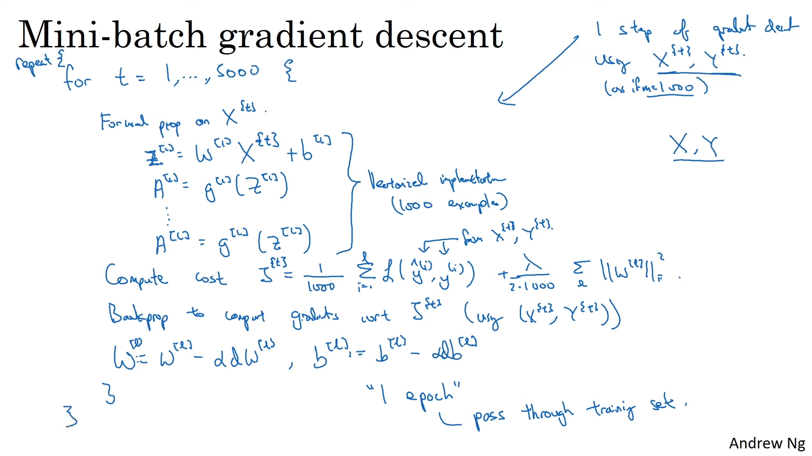

# Machine Learning

## Focusing on Neural Networks
    - Dense Neural Networks
    - Convolutional Neural Networks
    - Recurrent Neural Networks
    - Long Short Term Memory ( LSTM ) Neural Networks
    - Word Embedding
    - Attention
    - Transformers
    - LLMs
  
## Optimization algorithms
    1. Normalize inputs and shuffle input rows every iteration to achieve better results.
    2. Mean and SD is only calculated on the training set. test inputs and work environments must use same mean and sd to normalize the inputs.
    3. Because of vanishing and exploding gradients. it's better to initialize the weights to be close to 1.
   
    - Gradient Descent
      - Batch 
      - Stochastic
      - Hybrid

## NOTES

    In log loss, in fact gradient ascent must be used to maximize log likelihood. but by using negative sign in the loss function we effectively convert it into gradient descent.
    
    Neuron = Linear + activation ( Not actual formulae)
    Model = Architecture + trained parameters
    
### Vanishing and exploding gradients
    If weights happen to be w , then gradient scales by w^L where L is the number of layers. for large values of L,
    
    if w = 1 , result is contained.
    if w < 0 , gradient vanishes.
    if w > 0 , gradient explodes.

    hence a STANDARD NORMAL of weights is used to initialize the weights.

    Also it is good to note that weights must also be scaled with: 

    sqrt(1/n[l-1]) for sigmoid
    sqrt(2/n[l-1]) for relu
    (this is found with practical observations)

    where n is the number of input neurons of current layer (number of output neurons of previous layer)

### Momentum in Gradient descent:

    The idea is that instead of wildy jumping on every dimension , use the previous gradients (gradients are just directional vectors) to figure out which way needs more velocity and jump in that direction and avoid jumping to unnecessary dimensions.

    here v is just another parameter called Velocity and b(beta) is a hyperparameter called moment term or let's call it moment rate to be similar to learning rate.

    b goes from 0 to 1
    0 = normal SGD
    1 = it doesn't take current direction into account ( only take historical data)
    usually 0.9 is used.
### Bias and variance

    Even though the squiggly line tightly fit the true values in the training set. it did NOT do well in the testing set.

    so variance talks about how consistent or variable the results are for different datasets

    even though the straight line has HIGH bias, it has low variance. so it gives consistent results across all datasets.

    Ideally we need low bias for accurately representing the true relationship , and low variance to get consistent results across different datasets.

    so the best model ( simple to complex ) lies between underfitting and overfitting the data and can be found using:
    - Regularization
    - Boosting
    - Bagging
    
    

# Convolutional Neural Networks

# Recurrent Neural Networks

    Though normal neural network and conv networks have fixed number of inputs, we can unroll recurrent neural networks to have infinite inputs! 
    This works well for sequential data like:
        - Stock market prediction
        - Weather prediction
        - Text prediction
    where order of data matters

Here , all parameters ( weights and biases) are shared.

we do not use RNNs mostly as they suffer from Exploding and vanishing gradients. especially in feedback (w2 in the picture).

We fix it using LSTMs

# Long-Short term Memory

we have many "GATES" in a LSTM.
namely:
- Forget gate
- Input gate
- Output gate

The idea is to have a system to determine how much data is to be retained and added by using sigmoid and tanh activations

### Forget gate ( how much to forget previous data?)
    - Determines percentage of long term memory to retain. (or conversely to forget)
    - retain% = sigmoid(inp*w1 + stm*w2 + b1)
    - final formula : ltm = ltm*retain%
### Input gate ( how much to add to previous data?)
    - newLTM = tanh(inp*w1 + stm*w2 + b1)
    - retain% = sigmoid(inp*w3 + stm*w4 + b2)
    - newLTM = newLTM*retain%
    - ltm = ltm + newLTM
    - final formula : ltm = ltm*retain%
### Output gate ( how much to send to the next roll? )
    - retain% = sigmoid(inp*w1 + stm*w2 + b1)
    - final formula : stm = tanh(ltm)*retain%

Note: the weights and biases are shared across rolls!

# Word Embedding and Word2Vec

Word Embedding is the art of giving meanings to words.
we can do this by treating words as vectors.

doing operations on words mean that there is a fundamental understanding of the word that is captured by that vector.

say, a popular example: king - man + woman = queen
where all the words are basically LONG vectors hundreds of dimensions long ( one hot encoded )

we can find these "numbers" or "vectors" by using a simple neural network to predict the next word using say softmax

but using only one word to predict next word does NOT provide us with enough CONTEXT in which a word is used.

Word2vec is a Technique or a proposal that when implemented will give really good results.
it is based on the hypotheses that words that appear in similar contexts tend to have similar meanings

It uses two other main ideas:
    - Continuous Bag of Words (CBOW) - predicts the target word based on its surrounding context words
    - skip grad -  It takes a target word and predicts the context words that are likely to appear around it.

both give same results.

# Sequence2Sequence and Encoder and Decoder Neural Networks

This kind of network excels in getting a sequence of data from a different sequence of data.

best example of this kind of data is of course,
text translation. English to Hindi etc...

# Attention

Even LSTMs forget the words at the beginning!

here, we have two input words and two output words.
first we calculate the similarity between first output and the two (all) input words. 
- we use cosine similarity here, which is usually the dot product.
- now we need to find which word should have more influence on the output word. we do that by plugging the two cosine similarities into a softmax layer ( gives ratio or probability or weightage to each word ) and multiplying the with the input words and doing a weighted sum which results in the attention value for that output word.
- The next output word is determined by plugging in the attention values AND the last output word embeddings ( initally <SOS> or <EOS>) into a normal Dense layer and a softmax network to get the next word.
then we do it all again for the next word!

# Transformers

Step 1: Input to Word Embedding
Step 2: Word Embedding + Positional Encoding
Positional Encoding:
    different order of input should give different outputs.
    apparently they use something with cosine curves and stuff. and just add the word embeddings with these values.

Queries , keys and values  ( Self attention )
It seems similar to attention mechanism before. but basically it checks the cosine similarity between one words and all other words (including itself that's why it's called self attention)

to find self attention for a particular word.
we generate query ,key and values for each word. 
which is a fancy way of saying we use the positional encodings and add some weights to it to get a new vector.
one vector(key) for each word.
one vector(value) for each word.
one vecotr(query) for each word

then we find cosine similarity between the query of the word we are on and key of every other word.

then similar to attention in LSTMs
these values get fed into softmax then multiplied by its value vector and added up as a weighted sum.

this is the self attention value for the query word!

It is to note that only one set of key weights , value weights and query weights are shared across all words!
Also we can calculate the query, key and value weights at the same time. and then use them to get attention values when required.

AND we can do it parallelly which is the biggest advantage of transformers over LSTMs

### Multi head attention
it's not a big deal it's just multiple self attention cells stacked onto each other.

# PRO TIPS
 - Normalize outputs when necessary ( like when outputs are reaaly big)
 - Normalize outputs is not recommended for classification 
 - For binary classification , just use one neuron output with threshold >=0.5 as A and < 0.5 as B (scikit-learn).